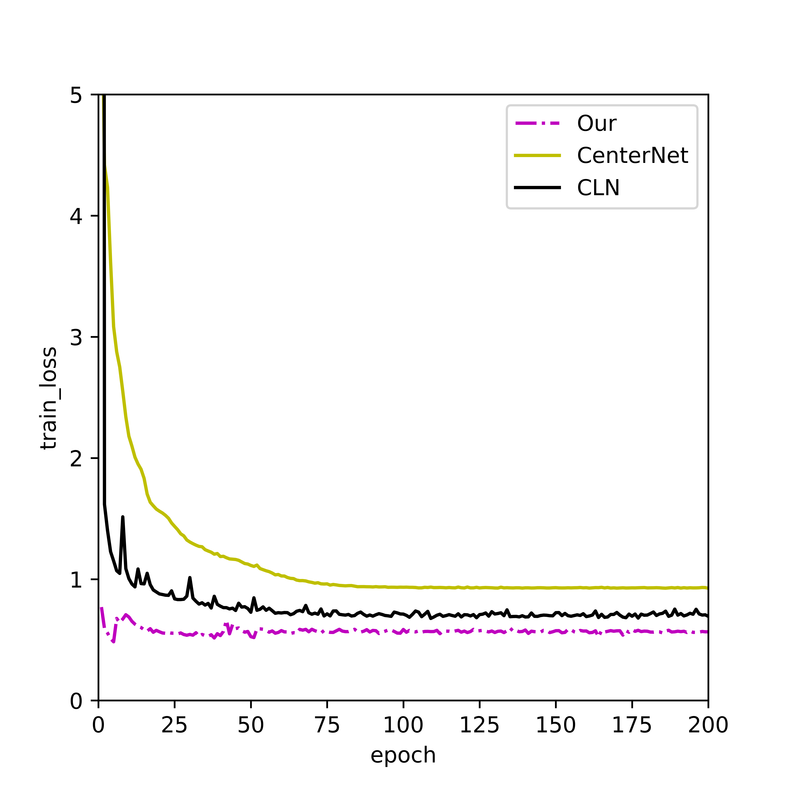

## SSNet2 Detection on Wideband signal

## Overview

This project implemented SSNet2 for Wideband signal detection and tested on simulated datasets and actual received wideband signals. 

### Training datasets and test datasets

Relevant training data sets and test data sets will be released in the near future.

### Example Output

> *Bounding box detection result of an time frequency spectrum of broadband signal


> *Predicted heatmap of object center points on an time frequency spectrum of broadband signal

### Best Model

> *Our trained model is placed on ./snapshot_best folder

## File Structure

```
├── SSNet
│ �├── dataset.py
│ �├── DLAnet.py
│ �├── loss.py
│ �├── predict.py
│ �├── train.py
│ �└── utils.py
├── dataset_split
│ �├── train.txt
│ �└── val.txt
├── environment.yml
```

This repository was developed and tested in PyTorch 1.5.

## How to run

- Intall required dependencies as listed in [environment.yml](./environment.yml)
- Modify signal dataset directory in centernet-vanilla/dataset.py
- Run [train.py](SSNet2/train.py) for training and [predict.py](SSNet2/predict.py) for inference


## Results


> *Compare evaluation results of our implementation to the original CenterNet on all datasets.*




> *An example image : The network loss function with epochs.*


> *The pipeline of our method for wideband signal detection and classification.*


> *Wideband signal detection Recall vs. Precision curve at GFSK signal

Figure above shows the precision-recall curve of our final model on the validation set. Three curves represent easy, moderate, and hard objects respectively. The area under the curve is the average precision (AP).

## Acknowledgement

We used the DLA-34 network, loss functions and some other functions from this [R-CenterNet repo](https://github.com/ZeroE04/R-CenterNet).

